<div align="center">

<picture>
  
</picture>

<br />

<a href="https://github.com/Maple0517/accountant"></a>
<a href="https://github.com/Maple0517/Pomotree"></a>

</div>

---

### Building calm, useful systems with a sharp edge.

I like products that feel fast, precise, and quietly powerful — from AI-assisted finance workflows to local-first focus tools.

- **Currently shaping:** [`accountant`](https://github.com/Maple0517/accountant), an AI-native personal finance workspace.
- **Also building:** [`Pomotree`](https://github.com/Maple0517/Pomotree), a local-first focus app with a calmer productivity loop.
- **Taste:** minimal interfaces, reliable automation, pragmatic architecture, and details that make software feel alive.

<div align="center">

```txt
product intuition  ×  full-stack engineering  ×  automation systems
```

</div>

### Core stack

`TypeScript` · `Next.js` · `React` · `Tauri` · `Rust` · `Supabase` · `Postgres` · `AI tooling` · `macOS automation`

### Featured work

| Project | Direction | Signal |
| --- | --- | --- |
| [`accountant`](https://github.com/Maple0517/accountant) | AI-assisted finance operations, transaction intelligence, personal data workflows | Practical automation with production-minded UX |
| [`Pomotree`](https://github.com/Maple0517/Pomotree) | Focus timer, task loops, macOS menubar experience, local-first productivity | Calm interface, native-feeling details |

<div align="center">

<a href="https://github.com/Maple0517?tab=repositories"></a>

</div>
